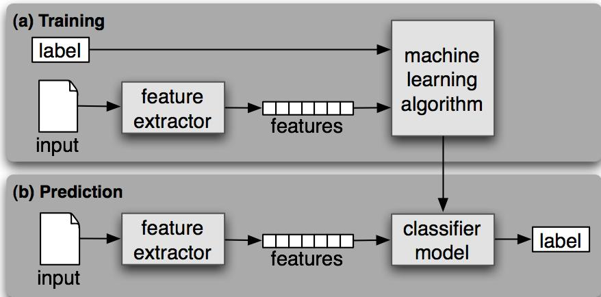

## 信息抽取实验三

### 情感分析

>         情感分析，有时也称为观点挖掘，是NLP领域一个非常重要的一个分支，它主要分析评论、文章、报道等的情感倾向，掌握或了解人们这些情感倾向非常重要。这些倾向对我们处理后续很多事情都有指定或借鉴作用。

#### 一、原理

1. 有监督分类

        分类 是为给定的输入选择正确的类标签的任务。在基本的分类任务中，每个输入被认为是与所有其它输入隔离的，并且标签集是预先定义的。这里是分类任务的一些例子：判断一封电子邮件是否是垃圾邮件。
        从一个固定的主题领域列表中，如“体育”、“技术”和“政治”，决定新闻报道的主题是什么。决定词bank给定的出现是用来指河的坡岸、一个金融机构、向一边倾斜的动作还是在金融机构里的存储行为。
        一个分类称为有监督的 ，如果它的建立基于训练语料的每个输入包含正确标签。
有监督分类：

        (a) 在训练过程中，特征提取器用来将每一个输入值转换为特征集。这些特征集捕捉每个输入中应被用于对其分类的基本信息，我们将在下一节中讨论它。特征集与标签的配对被送入机器学习算法，生成模型。

        (b) 在预测过程中，相同的特征提取器被用来将未见过的输入转换为特征集。之后，这些特征集被送入模型产生预测标签。
        

        基本的分类任务有许多有趣的变种。

- 在多类分类中，每个实例可以分配多个标签
- 在开放性分类中，标签集是事先没有定义的
- 在序列分类中，一个输入列表作为一个整体分类
2. 贝叶斯分类器

        **朴素贝叶斯分类器**代表着**一类**应用**贝叶斯定理**的分类器的总称。朴素（naive）在这里有着特殊的含义、代表着一个非常强的假设。朴素贝叶斯分类器虽然简单，但是用处非常广泛。朴素贝叶斯分类器以贝叶斯定理为基础。

* 贝叶斯定理

        贝叶斯定理的推导始于条件概率。条件概率可以定义为：在事件 B 发生的前提下，事件 A 发生的概率。数学上用  来表示该条件概率。条件概率  的数学定义为：

                                        

        这个公式的白话解释为：“当 B 发生前提下 A 发生的概率”等于“A 和 B 同时发生的概率”除以“B 发生的概率”。将上式左右两边同时乘以 ![[公式]](https://www.zhihu.com/equation?tex=P%28B%29) 得到：![[公式]](https://www.zhihu.com/equation?tex=P%28B%29P%28A%7CB%29%3DP%28A%5Ccap+B%29)

    类似的，我们也可以求出 P(B|A)，即在 A 发生的前提下，B 发生的概率是多少。

                                        .svg)

        同样，两边同时乘以 ![[公式]](https://www.zhihu.com/equation?tex=P%28A%29) ，并且由 ![[公式]](https://www.zhihu.com/equation?tex=P%28A%E2%88%A9B%29+%3D+P%28B%E2%88%A9A%29) ，得到：

![[公式]](https://www.zhihu.com/equation?tex=P%28A%29P%28B%7CA%29%3DP%28A%5Ccap+B%29)

由此可知 ![[公式]](https://www.zhihu.com/equation?tex=P%28B%29P%28A%7CB%29+%3D+P%28A%29P%28B%7CA%29) 。这个结果也可以写作如下形式，即大名鼎鼎的**贝叶斯定理（Bayes rule）**：

                                         .svg)

* 朴素贝叶斯

        令 ![[公式]](https://www.zhihu.com/equation?tex=%5Cbf+X) 代表一个 ![[公式]](https://www.zhihu.com/equation?tex=n) 维特征向量（它代表着一组特征，即 features），这些特征用来描述一个对象； ![[公式]](https://www.zhihu.com/equation?tex=C) 代表该对象所属的类别。分类的目的是找到 ![[公式]](https://www.zhihu.com/equation?tex=%5Cbf+X) 和 ![[公式]](https://www.zhihu.com/equation?tex=C) 之间的映射关系，从而计算出 ![[公式]](https://www.zhihu.com/equation?tex=P%28C%7C%5Cbf+X%29) ，即当待分类的对象具备 ![[公式]](https://www.zhihu.com/equation?tex=%5Cbf+X) 这些特征时，它属于 ![[公式]](https://www.zhihu.com/equation?tex=C) 类的条件概率。

具体的，假设类别的个数为 ![[公式]](https://www.zhihu.com/equation?tex=K) （即 ![[公式]](https://www.zhihu.com/equation?tex=C) 的取值有 ![[公式]](https://www.zhihu.com/equation?tex=K) 个），那么对于每一个可能的取值（记为 ![[公式]](https://www.zhihu.com/equation?tex=c_k) ， ![[公式]](https://www.zhihu.com/equation?tex=k+%3D+1%2C+2%2C%5Ccdots%2C+K) ），我们需要根据给定的特征 ![[公式]](https://www.zhihu.com/equation?tex=%5Cbf+X) 计算出概率 ![[公式]](https://www.zhihu.com/equation?tex=P%28C%3Dc_k%7C%5Cbf+X%29) 。然后，**只要从所有的** ![[公式]](https://www.zhihu.com/equation?tex=P%28c_k%7C%5Cbf+X%29) **中挑出取值最大的概率对应的** ![[公式]](https://www.zhihu.com/equation?tex=c_k) **作为最有可能的分类即可。**

        利用贝叶斯定理， ![[公式]](https://www.zhihu.com/equation?tex=P%28C%3Dc_k%7C%5Cbf+X%29) 可以写作：

                                .svg)

        由于对有所的 ![[公式]](https://www.zhihu.com/equation?tex=P%28C%3Dc_k%7C%5Cmathbf+X%29) 来说，上式右侧的分母都相同（和 ![[公式]](https://www.zhihu.com/equation?tex=C) 的取值无关），因此我们只需要根据训练集数据来估计所有的 ![[公式]](https://www.zhihu.com/equation?tex=P%28%5Cmathbf+X%7CC%3Dc_k%29) 以及所有的 ![[公式]](https://www.zhihu.com/equation?tex=P%28C%3Dc_k%29) 即可。但为了实现这个目标，若特征空间的维度 ![[公式]](https://www.zhihu.com/equation?tex=n+%3D+30) ，需要估计超过 30 亿个参数。

因为在求解 ![[公式]](https://www.zhihu.com/equation?tex=P%28%5Cmathbf+X%7CC%3Dc_k%29) 时，我们考虑的是 ![[公式]](https://www.zhihu.com/equation?tex=%5Cmathbf+X+%3D+%5C%7Bx_1%2C+x_2%2C+%E2%80%A6%2C+x_n%5C%7D) 在 ![[公式]](https://www.zhihu.com/equation?tex=C+%3D+c_k) 这个条件下的**条件联合分布**，这大大增加了待估计的参数的个数。为了解决这个问题，朴素贝叶斯在求解 ![[公式]](https://www.zhihu.com/equation?tex=P%28%5Cmathbf+X%7CC%3Dc_k%29) 时做了一个非常强的假设 —— **条件独立性（conditional independence）**。**它的意思是在给定的类别** ![[公式]](https://www.zhihu.com/equation?tex=C+%3D+c_k) **下，不同维度特征的取值之间是相互独立的。**比如令 ![[公式]](https://www.zhihu.com/equation?tex=X_1) 和 ![[公式]](https://www.zhihu.com/equation?tex=X_2) 代表 ![[公式]](https://www.zhihu.com/equation?tex=n) 维里面的两个维度，则 ![[公式]](https://www.zhihu.com/equation?tex=P%28X_1%3Dx_1%7CC%3Dc_k%29) 的概率与 ![[公式]](https://www.zhihu.com/equation?tex=X_2) 的取值无关，即：

.svg)

        **在朴素贝叶斯中，我们仅仅假设特征之间满足条件独立性，而非一般的独立性。**在条件独立性假设下，反复利用条件概率的定义，最终可以写为：

.svg)

* 贝叶斯分类器

        对于特征向量 ![[公式]](https://www.zhihu.com/equation?tex=%5Cbf+X) 和类别 ![[公式]](https://www.zhihu.com/equation?tex=C) ，利用贝叶斯定理和条件独立性的假设，写出每个 ![[公式]](https://www.zhihu.com/equation?tex=C+%3D+c_k) 的条件概率：

.svg)

        接下来使用训练集数据，估计出所有的 ![[公式]](https://www.zhihu.com/equation?tex=P%28C%3Dc_k%29) 以及 ![[公式]](https://www.zhihu.com/equation?tex=P%28X_i%3Dx_i%7CC%3Dc_k%29) 即可，而无需考虑上式中的分母，因为它和 ![[公式]](https://www.zhihu.com/equation?tex=C) 的取值无关。对于新的待分类样本，使用它的特征向量取值对每个 ![[公式]](https://www.zhihu.com/equation?tex=c_k) 求出 ![[公式]](https://www.zhihu.com/equation?tex=P%28C%3Dc_k%29+%C3%97+%5Cprod_i+P%28X_i%3Dx_i%7CC%3Dc_k%29) ，并比较这些值中最大的，就可以确定这个新样本的分类：

.svg)

#### 二、实验过程

* 训练集选择及处理

        实验时的训练集为nltk的语料库corpus的movie_reviews。原始数据中对每个评论已经做好标签分类，分为pos和neg两类，分别为积极和消极，我们可以通过`movie.fileids(type)`获得具体type类型的所有文本。然后对数据集进行一定的处理后再开始训练。

        首先通过fields方法获取某类的所有评论，再通过`movie_reviews.raw("file")`获得未处理的原始文本，接着使用`tokenize.sent_tokenize(raw_sents)`将一段话的文本按句分割。对于每个句子使用`raw_words = [tokenize.word_tokenize(s) for s in sents]`进行分词并进行词性标注，这样便于我们消去句子中的停用词，即某些极端通用的单词在帮助选择符合需求的文档方面几乎没有值，因此完全从词汇表中排除。

        我们可以思考一下，一个单词有多种形态，或者一个词义有多个单词表示，名词有单复数，动词有进行时和过去式，如果单纯按照原始的单词进行判断，同义的单词会因为不同形式而判断错误，造成较大的误差。所以我们要进行词性还原，就是去掉单词的词缀，提取单词的主干部分，通常提取后的单词会是字典中的单词，不同于词干提取（stemming），提取后的单词不一定会出现在单词中。比如，单词“cars”词形还原后的单词为“car”，单词“ate”词形还原后的单词为“eat”。`wordnet_pos = get_pos(tag[1]) or wordnet.NOUN`可以得到相应单词的词性，然后`words = wnl.lemmatize(tag[0], pos=wordnet_pos)`可以根据原单词和词性在字典中查找到还原后的单词。

        此时得到的还原后的单词，即对判断相应情感有一定权重和影响的单词，将所有单词合起来保存下来作为训练数据。完整代码如下

```python
def features(movie, type):
    # 读取句子
    pos_features = []
    stopWords = set(stopwords.words('english'))
    for f in movie.fileids(type):
        raw_sents = movie.raw(f)
        sents = tokenize.sent_tokenize(raw_sents)
        # 分割单词,去停用词
        raw_words = [tokenize.word_tokenize(s) for s in sents]
        words_features = [w for r in raw_words for w in r if w not in stopWords and len(w) > 2 and w.isalpha()]
        # 词性标注

        wnl = WordNetLemmatizer()
        words_tag = pos_tag(words_features)  # 获取单词词性
        lemmas_sents = []
        for tag in words_tag:
            wordnet_pos = get_pos(tag[1]) or wordnet.NOUN
            words = wnl.lemmatize(tag[0], pos=wordnet_pos)
            lemmas_sents.append(words)
        pos_features.append((extract_features(lemmas_sents), type))
    return pos_features
```

       

* 训练朴素贝叶斯分类器

        得到处理好的数据后，便可以进行开始训练，我们要将数据分为真正训练和测试文本两部分，来验证我们的训练结果。

```python
# 提取特征 800个积极文本800个消极文本构成训练集  200+200构成测试文本
    features_train = pos_features[:pos_threshold] + neg_features[:neg_threshold]
    features_test = pos_features[pos_threshold:] + neg_features[neg_threshold:]
```

        然后调用朴素贝叶斯分类器的train方法开始训练数据集并进行结果测试

```python
 classifier = NaiveBayesClassifier.train(features_train)
 print("\n分类器的准确性:", nltk.classify.util.accuracy(classifier, features_test))
```


        完整代码如下：

```python
def train():
    pos_features = features(movie_reviews, 'pos')
    neg_features = features(movie_reviews, 'neg')

    threshold_factor = 0.8
    pos_threshold = int(threshold_factor * len(pos_features))
    neg_threshold = int(threshold_factor * len(neg_features))
    # 提取特征 800个积极文本800个消极文本构成训练集  200+200构成测试文本
    features_train = pos_features[:pos_threshold] + neg_features[:neg_threshold]
    features_test = pos_features[pos_threshold:] + neg_features[neg_threshold:]

    # 训练朴素贝叶斯分类器
    classifier = NaiveBayesClassifier.train(features_train)
    print("\n分类器的准确性:", nltk.classify.util.accuracy(classifier, features_test))
    return classifier
```

+ 情感分析

        分类器训练好我们便可以将我们想要分析的数据写入，通过`probdist = classifier.prob_classify(extract_features(review.split()))`可以将一句话分词，然后放到分类器中利用朴素贝叶斯的原理进行结果计算，调用`probdist.max()`可以获得计算结果即情感倾向（pos或neg），然后再使用`score = round(probdist.prob(pred_sentiment), 2)`可以获得相应结果的可靠度。

        但是我们应该考虑到，电影评论文本的内容是多样的、不固定的，并且夹杂很多语气词、短句，且分类器只能对一句话进行训练，评论是一段的，有多句。所以需要在一句话的分类上进行改进。

        对于一段评论，我们将其分句，然后对其中的停用词进行处理，降低无用词对结果的影响。

```python
sentences = nltk.sent_tokenize(text_name)
yuce,realsocre = learning.analyze(sentences, classifier)
```

        我们对于每一句话进行，分析得到其结果和可靠度(result1,score1)，(result2,score2)，(result3,score3)。。。，虽然评论整体的情感分析是一定的，但每句话分析出来的结果是不一定的，且每个句子的可靠度都有较大的差距。因此通过score>accuracy，将分析结果可靠度大于分类器准确性的结果对筛选出来，根据权重，计算整体的可靠度，以此来决定整段文本的可靠度。

$$
\frac{\sum_{i=0}^N{score_i}*{(-1)^{result_i} }}{N}
$$

```python
# 运行分类器，获得预测结果
def analyze(reviews, classifier):
    ans = ""
    score_pos = []
    score_neg = []
    for review in reviews:
        probdist = classifier.prob_classify(extract_features(review.split()))
        pred_sentiment = probdist.max()
        # 打印输出
        score = round(probdist.prob(pred_sentiment), 2)

        if score > 0.7:
            if pred_sentiment == "pos":
                score_pos.append(score)
            else:
                score_neg.append(score)
    sum_pos = 0.0
    sum_neg = 0.0

    for score in score_pos:
        sum_pos += score

    for score in (score_neg):
        sum_neg += score

    real_score = 0.0
    if sum_pos > sum_neg:
        ans = "pos"
        real_score = sum_pos / len(score_pos)
    else:
        ans = "neg"
        real_score = sum_neg / len(score_neg)

    return ans, real_score
```


* 准确度以及召回率

        对于一个二分类系统，将实例分为正类（Positive）、负类（Negative），则模式分类器有四种分类结果：

> - TP（True Positive）：正确的正例，一个实例是正类并且也被判定成正类
> - FN（False Negative）：错误的反例，漏报，本为正类但判定为假类
> - FP（False Positive）：错误的正例，误报，本为假类但判定为正类
> - TN（True Negative）：正确的反例，一个实例是假类并且也被判定成假类

###### **准确率**

        所有的预测正确（正类负类）的占总的比重。

.svg)

###### **召回率**

        即正确预测为正的占全部实际为正的比例。召回率(Recall) 是针对原样本而言的，其含义是在实际为正的样本中被预测为正样本的概率。高的召回率意味着可能会有更多的误检，但是会尽力找到每一个应该被找到的对象。

.svg)

###### **精确率**

        也叫查准率，即正确预测为正的占全部预测为正的比例。精确率代表对正样本结果中的预测准确程度，准确率则代表整体的预测准确程度，包括正样本和负样本。分母是预测到的正类，精确率的提出是让模型的现有预测结果尽可能不出错。

.svg)

###### **F-Score：召回率与精确率的博弈**

        精确率和召回率互相影响，理想状态下肯定追求两个都高，但是实际情况是两者相互“制约”：**追求精确率高，则召回率就低；追求召回率高，则通常会影响精确率**。我们当然希望预测的结果精确率越高越好，召回率越高越好， 但事实上这两者在某些情况下是矛盾的。这样就需要综合考虑它们，最常见的方法就是F-score。

.svg)

        我们对所进行分析的数据集进行了手动标注，通过比对程序分析结果从而计算出各项指标。

```python
   for review in reviews:    
       ...
       ...
       ...
       if (yuce == "pos") & (emo_list[count] == "positive"):
            TP += 1
       elif (yuce == "neg") & (emo_list[count] == "positive"):
            FN += 1
       elif (yuce == "neg") & (emo_list[count] == "negative"):
            TN += 1
       elif (yuce == "pos") & (emo_list[count] == "negative"):
            FP += 1

       count += 1

    print("正确率： ",float(TP+TN)/float(TP+TN+FN+FP))
    print("召回率： ",float(TP)/float(TP+FN))
```


![补一个结果   准确率]

### 摘要总结

>         对于一段电影评论，用户往往可能夹杂较一些带有情绪的语气短句或者是有一些重复的观点、对情节的复述，对于想要快速获得评论内容造成一定影响，所以可以利用python的combination进行相似度比较，建立一个句子之间的有向图，利用PageRank算法挑选出具有代表性的句子作为文章摘要。

#### 		文本处理

        我们想要建立一个支持多语言的摘要总结处理程序。对于一段评论，我们还是要首先进行分句、停用词处理以及词干提取，以便于后续的相似度比较等操作。

>         词干提取( Stemming ) 这是西方语言特有的处理，比如说英文单词有单数复数的变形，-ing和-ed的变形，但是在计算相关性的时候，应该当做同一个单词。比如 apple和apples，doing和done是同一个词，提取词干的目的就是要合并这些变态。

        分句使用`tokenize.sent_tokenize(text, self.language)`，停用词处理时将句子中的每个单词进行筛选`if word.isalnum() and word not in self.stopwords`，词干提取我们使用`stemmer = stem.SnowballStemmer(language)`，调用方法`stemmer.stem(word)`替换原有单词。

```python
class LanguageProcessor(object):
    def __init__(self, language):
        self.language = language
        self.stopwords = corpus.stopwords.words(language)
        self.stemmer = stem.SnowballStemmer(language)

    def split_sentences(self, text):
        return tokenize.sent_tokenize(text, self.language)

    def extract_significant_words(self, sentence):
        return set(
            word for word in tokenize.word_tokenize(sentence)
            if word.isalnum() and word not in self.stopwords
        )

    def stem(self, word):
        return self.stemmer.stem(word)

```

        获得一段评论后，用LanguageProcessor类进行各项处理，然后建立有向图networkx.Graph，并对评论中的所有句子通过`combinations(enumerate(stemsets) 2)`, 2)进行维度为2的排列组合怕pairs。我们可以得到如下的结果（例）：

```textile
((2, {'show', 'trust', 'heart', 'timid', 'faint'}), (3, {'this', 'regard', 'drug', 'show', 'sex', 'punch', 'violenc', 'pull'}))
((2, {'show', 'trust', 'heart', 'timid', 'faint'}), (4, {'classic', 'call', 'use', 'hardcor', 'given', 'nicknam', 'it', 'secur', 'oswald', 'br', 'maximum', 'state', 'oz', 'penitentari'}))
((2, {'show', 'trust', 'heart', 'timid', 'faint'}), (5, {'experiment', 'section', 'focus', 'front', 'emerald', 'main', 'glass', 'prison', 'it', 'inward', 'high', 'face', 'agenda', 'cell', 'citi', 'privaci'}))
((2, {'show', 'trust', 'heart', 'timid', 'faint'}), (6, {'deal', 'latino', 'home', 'mani', 'i', 'br', 'dare', 'say', 'fact', 'citi', 'would', 'muslim', 'agreement', 'scuffl', 'irish', 'em', 'appeal', 'stare', 'christian', 'far', 'death', 'show', 'gangsta', 'aryan', 'italian', 'dodgi', 'never', 'goe', 'shadi', 'main', 'due'}))
```

#### 		摘要提取

        我们提取出pairs中的组合，分别为(index_a, stems_a), (index_b, stems_b)，index是句子的序号 stems是set集合（set可以去重，避免重复词语对相似度计算的影响），对于stems我们进行相似度计算`similarity = 1 - jaccard(stems_a, stems_b)`。

>         杰卡德距离(Jaccard Distance) 是用来衡量两个集合差异性的一种指标。
> 
> 

        我们以句子序号为点的编号，相似度为相应两点之间的权重，添加到前边定义的Graph中。然后就是最重要的通过PageRank算法对图进行链接分析，句子的取舍将取决于分析结果。简单地说，PageRank将计算出每个句子的重要性（与其相似句子的个数或相似度较高）。

>         历史上，PageRank算法作为计算互联网网页重要度的算法被提出。PageRank是定义在网页集合上的一个函数，它对每个网页给出一个正实数，表示网页的重要程度，整体构成一个向量，PageRank值越高，网页就越重要，在互联网搜索的排序中可能就被排在前面。
> 
>         假设互联网是一个有向图，在其基础上定义随机游走模型，即一阶马尔可夫链，表示网页浏览者在互联网上随机浏览网页的过程。假设浏览者在每个网页依照连接出去的超链接以等概率跳转到下一个网页，并在网上持续不断进行这样的随机跳转，这个过程形成一阶马尔可夫链。PageRank表示这个马尔可夫链的平稳分布。每个网页的PageRank值就是平稳概率。
> 
>         设一个有向图，结点 ![[公式]](https://www.zhihu.com/equation?tex=A) ， ![[公式]](https://www.zhihu.com/equation?tex=B) ， ![[公式]](https://www.zhihu.com/equation?tex=C) 和 ![[公式]](https://www.zhihu.com/equation?tex=D) 表示网页，结点之间的有向边表示网页之间的超链接，边上的权值表示网页之间随机跳转的概率。假设有一个浏览者，在网上随机游走。如果浏览者在网页 ![[公式]](https://www.zhihu.com/equation?tex=A) ，则下一步以 ![[公式]](https://www.zhihu.com/equation?tex=1%2F3) 的概率转移到网页 ![[公式]](https://www.zhihu.com/equation?tex=B) ， ![[公式]](https://www.zhihu.com/equation?tex=C) 和 ![[公式]](https://www.zhihu.com/equation?tex=D) 。如果浏览者在网页 ![[公式]](https://www.zhihu.com/equation?tex=B) ，则下一步以 ![[公式]](https://www.zhihu.com/equation?tex=1%2F2) 的概率转移到网页 ![[公式]](https://www.zhihu.com/equation?tex=A) 和 ![[公式]](https://www.zhihu.com/equation?tex=D) 。如果浏览者在网页 ![[公式]](https://www.zhihu.com/equation?tex=C) ，则下一步以概率 ![[公式]](https://www.zhihu.com/equation?tex=1) 转移到网页 ![[公式]](https://www.zhihu.com/equation?tex=A) 。如果浏览者在网页 ![[公式]](https://www.zhihu.com/equation?tex=D) ，则下一步以 ![[公式]](https://www.zhihu.com/equation?tex=1%2F2) 的概率转移到网页 ![[公式]](https://www.zhihu.com/equation?tex=B) 和 ![[公式]](https://www.zhihu.com/equation?tex=C) 。
> 
> 
> 
>         直观上，一个网页，如果指向该网页的超链接越多，随机跳转到该网页的概率也就越高，该网页的PageRank值就越高，这个网页也就越重要。一个网页，如果指向该网页的PageRank值越高，随机跳转到该网页的概率也就越高，该网页的PageRank值就越高，这个网页也就越重要。PageRank值依赖于网络的拓扑结构，一旦网络的拓扑(连接关系)确定，PageRank值就确定。
> 
>         而在我们的实验中，网页即是评论中的语句，跳转链接即相似度，计算结果即语句在评论中与其他语句的相似程度，越高则越具有代表性。

        计算出pagerank值后，对句子进行降序排序，挑出前面的若干句则可以近似的看作一个摘要而提取出来。

```textile
(0, 0.11333618589141183) #句子序号，pagerank
(1, 0.1459263574191503)
(4, 0.10337991792208497)
(7, 0.0750302601331841)
(8, 0.1725865065801548)
(9, 0.09694021613893296)
(3, 0.09223356711043143)
(6, 0.08596180352125007)
(2, 0.05671552418003166)
(5, 0.057889661103368004)
```

        整体代码如下：

```python
def summarize(text, sentence_count=5, language='english'):
    processor = LanguageProcessor(language)

    #分句
    sentence_list = processor.split_sentences(text)
    #对每个句子进行处理 去停用词  一个句子一个set
    wordset_list = map(processor.extract_significant_words, sentence_list)
    #对于set中的每个词进行替换
    stemsets = [
        {processor.stem(word) for word in wordset}
        for wordset in wordset_list
    ]

    graph = Graph()
    #返回长度为2的子序列
    pairs = combinations(enumerate(stemsets), 2)
    for j in pairs:
        print(j)
    for (index_a, stems_a), (index_b, stems_b) in pairs:
        #print(index_a,index_b)
        #index是词语的序号  stems是set集合
        if stems_a and stems_b:
            #计算差距  并记录任意两个序号间的相似度  记录在图中
            similarity = 1 - jaccard(stems_a, stems_b)
            if similarity > 0:
                graph.add_edge(index_a, index_b, weight=similarity)

    ranked_sentence_indexes = list(pagerank(graph).items())
    #print(ranked_sentence_indexes)
    if ranked_sentence_indexes:
        #itemgetter表示比较时取下标为1的数据
        sentences_by_rank = sorted(
            ranked_sentence_indexes, key=itemgetter(1), reverse=True)
        #取前几个相似度低的
        best_sentences = map(itemgetter(0), sentences_by_rank[:sentence_count])
        best_sentences_in_order = sorted(best_sentences)
    else:
        best_sentences_in_order = range(min(sentence_count, len(sentence_list)))

    return ' '.join(sentence_list[index] for index in best_sentences_in_order)
```


### 通过NLTK库对影评进行关系抽取

> ​        首先对一段电影评论进行人为判断，综合信息点应有 1. 影评信息摘要 2. 评价的影视对象；3. 评价的影视组织；4. 电影故事发生的地点；5.积极评价词；6. 消极评价词；7. 电影推荐指数。基于此，使用python nltk自然语言处理库对电影评论进行信息抽取。主要分为获取影评，分句，分词，标注，命名实体识别以及信息抽取6个步骤。

#### 获取影评

​		通过get_text_list函数获取.csv影评文件中的内容，返回值为影评文本列表text_list，影评情感列表emo_list；text_list用于影评内容关系抽取，emo_list用于判断情感分析的正确度；

```python
def get_text_list(text_list, emo_list, path):
    count = 0
    data = pd.read_csv(path, sep=',', header=None, encoding_errors="ignore")
    for i in range(0, len(data)):
        text_list.append(data[0][i])
        emo_list.append(data[1][i])
        count = count + 1
	print("Loading Complete\nTotal: ", count)
```

#### 分句

​		使用nltk库sent_tokenize()对text_list列表一个影评内容元素进行分句，结果存于sentence列表。

```python
# 分句
sentences = nltk.sent_tokenize(text_name)
```


#### 分词

​		使用nltk库word_tokenize()对sentence列表一个元素进行分词，结果存于tokenized_sentences列表

```python
# 分词
tokenized_sentences = [nltk.word_tokenize(sentence) for sentence in sentences]
```


#### 标注

​		使用nltk库pos_tag()对分词后的列表一个元素进行词性标注——形容词、动词、名词、副词，结果存于tagged_sentences列表

```python
# 标注
tagged_sentences = [nltk.pos_tag(sentence) for sentence in tokenized_sentences]
```


#### 命名实体识别

​		对标注后的单词列表进行命名实体的识别，对每一个句子都获得一个Tree元组，包含句子中的每个单词与其词性的二元组。

```python
# 命名实体识别
ne_chunked_sents = [nltk.ne_chunk(tagged) for tagged in tagged_sentences]
```


#### 信息抽取

​		构造正则表达式匹配目的句子并提取相应信息，pr_temp可匹配 a in b | a is b | a was b | a were b | a are b的信息，nltk.sem.extract_rels函数匹配正则表达式并抽取a作为人名person，b作为地点location。

```python
pr_temp = re.compile(r'.*(\bin\b|\bis\b|\bwas\b|\bwere\b|\bare\b)')

for sent in ne_chunked_sents:
	for rel in nltk.sem.extract_rels('PER', 'LOC', sent, corpus='ace', pattern=pr_temp, window=10):
		print("-----", nltk.sem.rtuple(rel))
```

​		对正则匹配的影评句子进行标签分析，若为Person标签，则加入name_dict字典:Key为名字name, value为改名字在影评中的出现次数；若为Organization标签，则加入organization_dict字典进行统计；若为GPE标签，则加入gpe_dict字典进行统计。

```python
for ne_taged_sentence in ne_chunked_sents:
	for tagged_tree in ne_taged_sentence:
		if hasattr(tagged_tree, 'label'):
			type = tagged_tree.label()
			if type == "PERSON":
				name = ""
				for tagged_left in tagged_tree:
 					name += ' ' + tagged_left[0]
					name = name[1:]
					if name in name_dict:
						name_dict[name] += 1
					else:
						name_dict[name] = 1
			elif type == "ORGANIZATION":
				organization = ""
				for tagged_left in tagged_tree:
                    organization += ' ' + tagged_left[0]
                    organization = organization[1:]
                    if organization in organization_dict:
                        organization_dict[organization] += 1
                    else:
                        organization_dict[organization] = 1
            elif type == "GPE":
                gpe = ""
				for tagged_left in tagged_tree:
					gpe += ' ' + tagged_left[0]
					gpe = gpe[1:]
					if gpe in gpe_dict:
						gpe_dict[gpe] += 1
					
                else:
						gpe_dict[gpe] = 1
```

​		通过载入NLTK库情感词文档，进行正面评价与反面评价的抽取；

```python
sid = SentimentIntensityAnalyzer()

pass

pos_word_set = set()
neu_word_set = set()
neg_word_set = set()

for sent in tokenized_sentences:
	for word in sent:
		if (sid.polarity_scores(word)['compound']) >= 0.5:
			pos_word_set.add(word)
		elif (sid.polarity_scores(word)['compound']) <= -0.5:
			neg_word_set.add(word)
		else:
			neu_word_set.add(word)
```


### 实验结果

> 对影评进行信息抽取，抽取的信息点为  1. 影评摘要；2. 影评对象；3. 影视组织；4. 故事发生地点；5. 正面评价； 6. 反面评价；7. 情感分析；8. 推荐指数。

#### 对单文本的信息提取

​		在文本框中输入影评信息，点击infoExtract按钮即可进行影评关系抽取，测试结果如下：


#### 对多文本的信息提取

​			点击choose file按钮进行选择数据文件，选择结束后会显示所选文件的路径，点击infoExtract按钮进行信息抽取；


​			多文本的信息抽取结果信息写在log.txt文件中


#### 对信息抽取结果进行人工评价

​		综合影评信息，发现并不是所有的影评都具有如上的信息点，如人名、影视组织，并不出现在每篇影评中，对于多影评文本的信息抽取，存在少数无完整信息点的例子，这是客观存在的事实；这种情况下，可对于该信息进行归类，根据其他的抽取的信息点进行相似度归类，通过这种方法使虽然抽取的结果信息不完整但仍具有普遍意义。对于影评信息抽取中的推荐指数，我们设定满分为10颗星，根据情感分析的可靠度reliability抽取出推荐指数，模拟为int(reliability * 10)颗星，直观的表示影评者的态度；对于持反面意见的影评，不显示推荐指数，即表示不推荐。对于抽取信息的准确性，在实验过程中，仅对抽取信息的权重模拟为出现次数的降序排序，认为出现次数最多的词为信息抽取的关键词，未进行更加深入的上下文分析与语境的分析，抽取的结果具有一定的不准确性。根据如上的单文本信息抽取的例子，"A gritty look at New York City and dock workers"——对纽约市与码头工人的真实写照，提取出故事发生的地点为纽约市；"also starring Sidney Poitier"——也由Sidney Poitier主演，"John Cassavetes was a fantastic director and actor"——John Cassavetes是一位出色的导演和演员，根据出现次数进行倒排抽取出评价对象Sidney Poitier；从全篇抽取出正面评价fantastic，great以及反面评价brutal；根据情感分析抽取出影评人的情感为positive，可靠度为0.8，推荐指数为0.8 * 10 = 8颗星。人工评价此信息抽取是大致准确的，能够抽取出影评的摘要abstract和其中所提到的对象，组织，地点，积极与反面评价以及情感，推荐指数；但对于出现信息点的权重相同的情况，仅根据数量进行倒排并不能十分准确地体现影评主观重点，需要结合更多的语境或者进行更深层次的机器学习的训练，这也是我们需要改进的地方。


## 改进

摘要的效果不是很好

摘要的文本处理可以加词形还原

情感分析的分类器改进
